# Predicting English Essay Score

By Nicholas Lee, Kevin Demsich, Harry Lu

### Problem Motivation

Writing is a foundational skill. Sadly, it's one few students can hone,
often because writing tasks are infrequently assigned in school. A
rapidly growing student population, students learning English as a
second language, known as English Language Learners (ELLs), are
significantly affected by the lack of practice. While automated feedback
tools make it easier for teachers to assign more writing tasks, they are
not designed with ELLs in mind.

Existing tools cannot provide feedback based on the student's language
proficiency, resulting in a final evaluation that may be skewed against
the learner. Data science may be able to improve automated feedback
tools to support the unique needs of these learners better.

We propose to build a model to facilitate this scoring process. A
service that could automatically score students' essays would be our
ultimate goal. Still, for this project, we aim to build a supervised
machine learning model that can learn from current grading and use it to
score unseen essays.

We found this project has significant potential value as it provides
more resources for education. With this model, lecturers can save time
on other high priorities such as class material design and live session
preparation.

### Dataset Description

The data contains one input field and five output fields. The input
field is the text field, which is the essay. We ran some exploratory
analysis on the input data and provided the summary below. The first
column is the text_id as a unique identifier, and the second is the
input column, the full text. After that, we have six rank-type metrics
corresponding to each full text. The data is suitable for training both
regression and classification models.

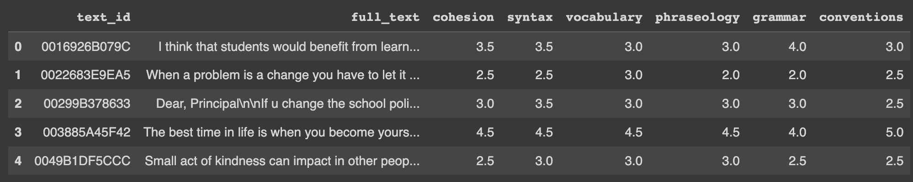

### Exploratory Data Analysis (finding relationships, creating metadata)

Before we built a model, the team studied the data, including some
exploratory data analysis. We assume we can learn more about data or
conduct feature engineering if we find some opportunities.

#### Input Data: Text Field

We know the average word count is 430, and the distribution ranges
heavily between 200 and 600.

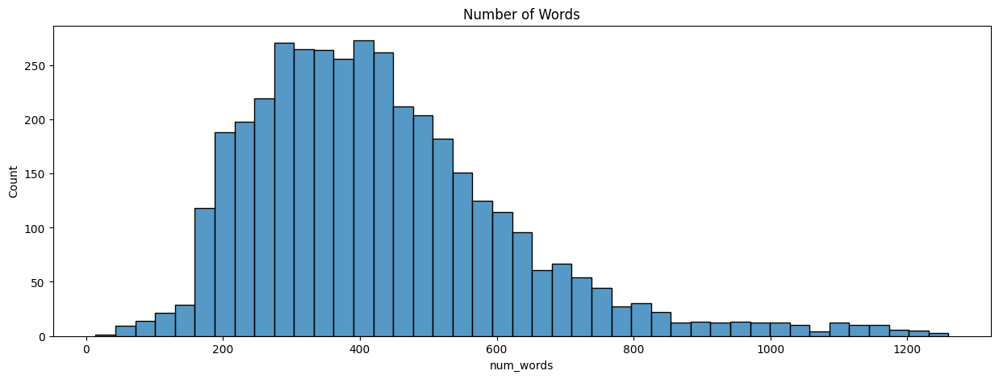

Figure 1: the average word counts of the input text field

We also ranked the top words used in the text, and the top 5 popular
words are “I,” “people,” “student,” “school,” and “get.” We can also see
the major topics discussed in the essays from the word cloud.

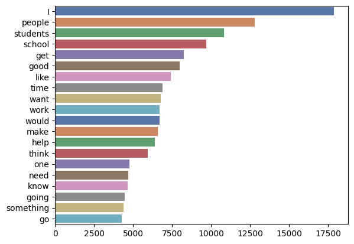
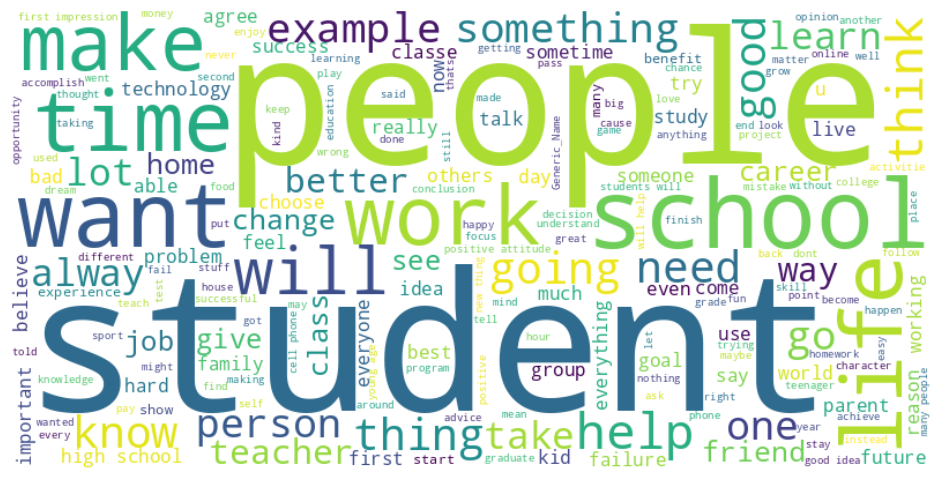

Figure 2: popular words from text field / Figure 3: word cloud produced
from essays

Besides counting the occurrences of single words, we also explore the
occurrences of a combination of words. This is a technique called
**ngram**. For example, the top occurrence of the combination when ngram
equals five are below:

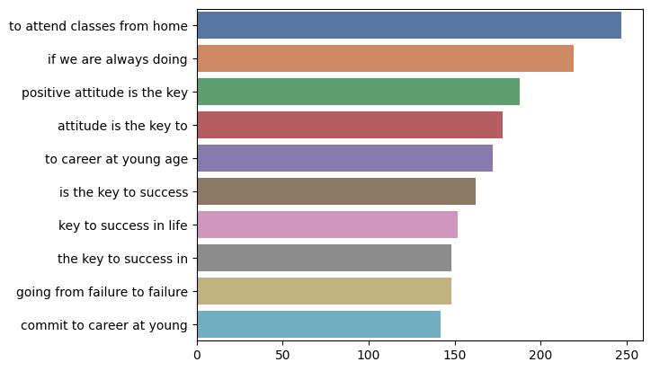

Figure 4: the top combinations (ngram=5)

With those EDA, we learned that (1) the scores are centered in 3, and
the labels are imbalance, (2) the scores are positively correlated, (3)
the average input length for us to decide the truncate threshold, and
(4) the common words, phrase, etc.

We also used a pre-trained model BERTTopic to detect the topics from
those essays. The result suggested the popular topics from the essays
are, for example, people, life, online classes, school, and positive
attitude.

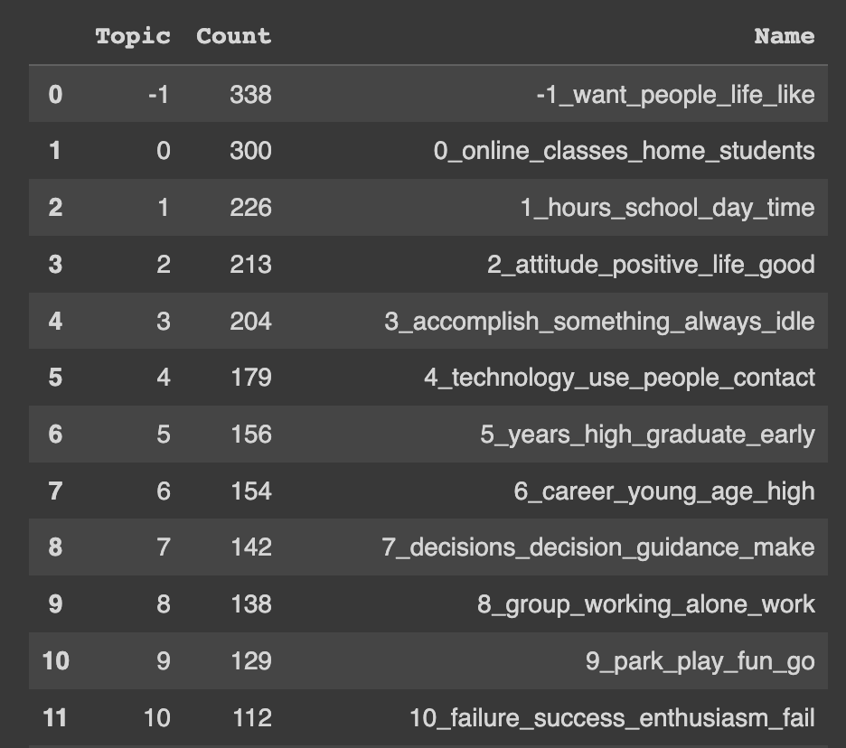

#### Output Data: Scores

Each text sample has six output metrics that we need to predict:

1.  Cohesion

2.  Syntax

3.  Vocabulary

4.  Phraseology

5.  Grammar

6.  Conventions

These metrics are the scores evaluated from the essay and are on a
discrete scale from 1 to 5 in 0.5 increments. Based on the output
metrics, we found the distribution of the scores heavily centered on 3,
especially for metrics like vocabulary. This will create a problem of
“imbalanced labels” as we may not have enough labels of 1, 1.5, 4.5, and
5, and their corresponding essay. When there are not enough labels for
the other classes, the model will acquire a bias to predict the most
common class most of the time, as the other classes are seen too
infrequently to be differentiated between.

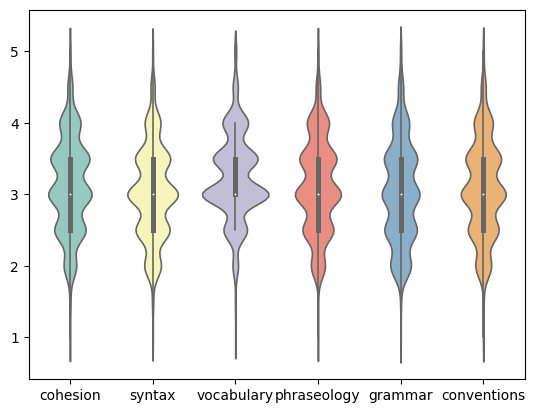

Figure 5: The distribution of the output metrics

We also checked the correlation between these scores and found that the
scores positively correlated with each other.

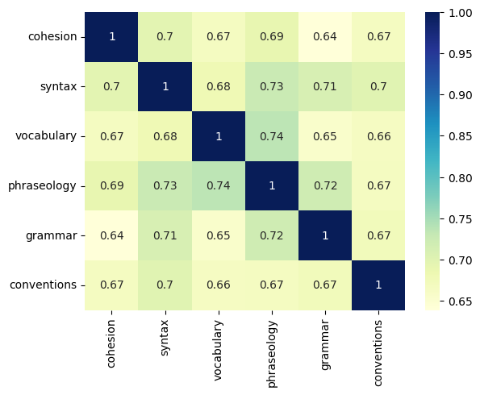

Figure 6: the correlation between each scoring metric

To illustrate the grouping of the average composite score of all six
characteristics, we investigated the relationship between the highest
score a student receives and their average score. We found there is a
strong correlation between the highest score attained and the average
composite score.

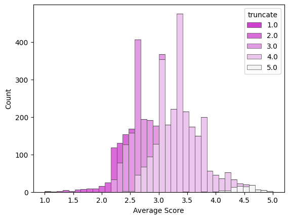

Figure 7: the relationship between the highest single score and the
average composite score

### ML Approaches

We plan to use embedding for this project. With the embedding, we can
understand each word used in the essay and how “the occurrence of a
word” matters in the score prediction.

#### Clean Feature, Data Preprocessing, and Train-Test Split

We first prepared the data by building customized text-cleaning
functions. And before we started training, we ran a 60-40 train-test
split to cut the data to 2,737 training samples and 1,174 testing
samples. We also performed feature configurations, such as truncating
the input to the desired length of 512 characters.

#### Build the model, leveraged on the pre-trained Bert model and LSTM layers

We used the pre-trained Bert Base Cased model to “learn” the essay and
use the information from Bert for the downstream task. We then take the
output from the Bert model to the LSTM layer, which can process not only
single data points but also entire data sequences, including the text
input we dealt with.

#### Train and Evaluate the Model

After we build the model, we will evaluate the model by calculating the
accuracy of the prediction against the y output label.

#### Baseline Model

To have a baseline comparison, we assumed a baseline model called
“always predict 3!” as 3 is the most frequent score in the dataset. With
this model, the accuracy is calculated as 38%

### Training

We set our model in the structure below. Starting with the TFBertModel,
followed by LSTM layers and batch normalization layers. After the LSTM
and normalization, we used two pooling layers and fed them to one output
layer. The training took, on average, 1.5 hours to complete for each
epoch. Due to the limited time and computing resources, we chose
vocabulary score as the only output to predict before expanding the
model to other outputs.

The below structure represents the model we use:

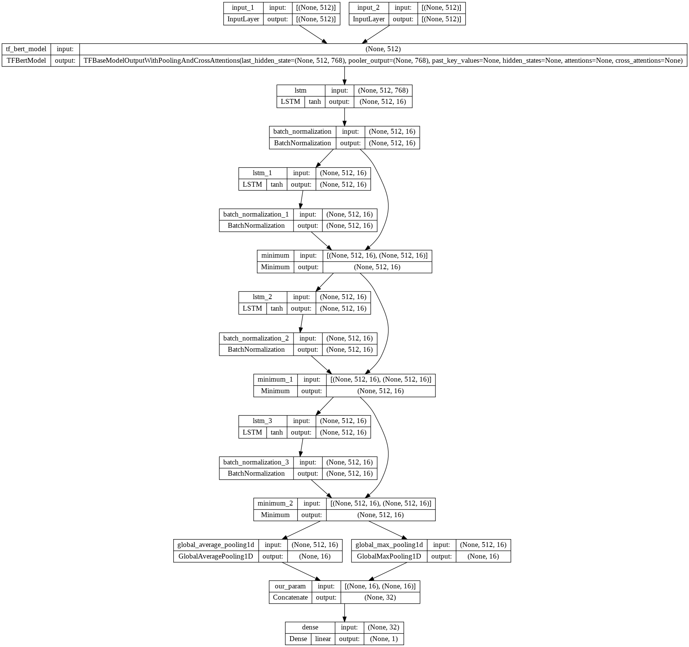

Figure 8: Model structure with layers, shape, and activate functions

### 

###  

### Result

We learned 56,737 parameters in the model. The model provides an
accuracy of 36%. But the distribution is more closer to the true label.

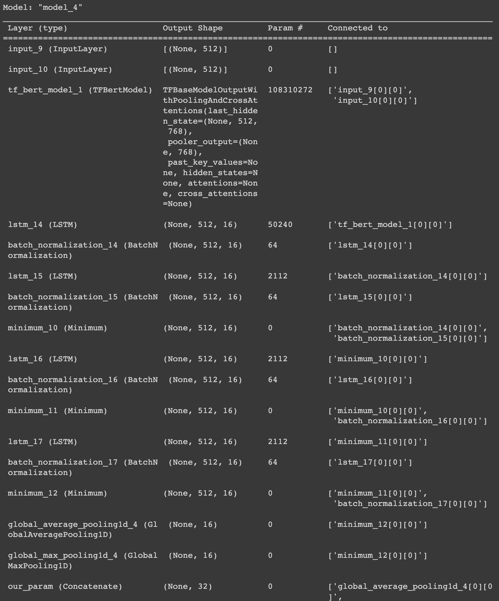

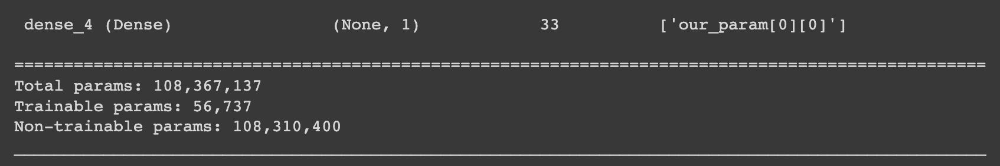

Figure 9: the model summary

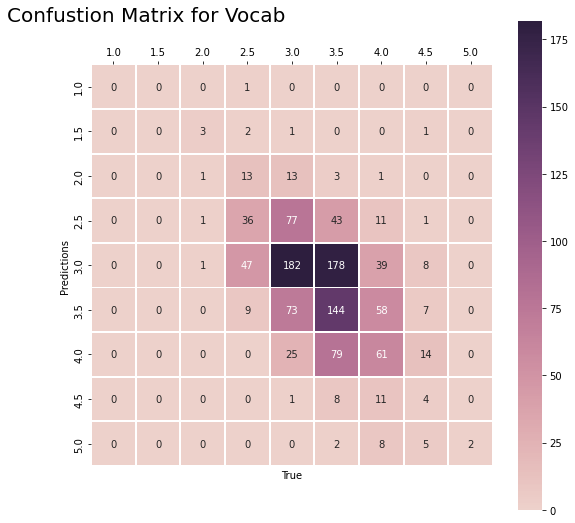

Figure 10: the Confusion Metrix for Vocabulary Score

### Conclusion

Our model predicted the vocabulary metric's scores with 36% accuracy but
better distribution on the prediction label. We conclude that this model
can potentially help future iterations for other output metrics and meet
the goal of reducing the time of human review on essays. We also see
some opportunities for improvement, which we will list in the Future
Work session.

From the Kaggle competition, the highest score attained was 43.3% across
all 6 output metrics. It appears that having more training examples from
the near edge-distribution classes would greatly improve the model
results for all participants in the study. Data augmentation approaches
are limited in improving model performance without introducing too much
bias or overfitting to known examples. Although these results are
currently unsuitable for a fully automated system to facilitate grading,
this experiment lays the groundwork for promising future research into
this sector.

### Future Work

In the future work session, we want to highlight some of our progress
and plan to explore more as a future work plan.

#### Imbalance Data

From the exploratory data analysis, we know the output label is centered
about 3 and has very few labels for extreme scores, such as 1 or 5.
Therefore, this might cause some issues due to imbalanced data. We
created the synthesized sample to minimize the effect to solve the data
imbalance issue. The approach we took is oversampling the data, as we do
not want to lose data if we choose to undersampling. Given the few
examples, we had for edge scores, using undersampling would restrict all
other classes for which we have many responses to be limited to equal
quantities. On the other hand, using oversampling, we could generate new
examples from the limited set of examples we had on the edge cases to
build up an equal pool of essays for the model to learn from.

Logistically, we produced the expanded data set before training the
machine learning model. Several methods are available to oversample a
dataset used in a typical classification problem. And the approach we
chose is the Synthetic Minority Oversampling Technique or SMOTE for
short. Leveraging the SMOTE technique, we synthesize more samples to
balance the under-represented labels \[1, 1.5, 2, 4, 4.5, 5\]. We added
1000 examples for each underrepresented class as proof of concept. With
this, we alleviated the imbalance issue for our model, aiming to produce
a more robust learning effect and improve overall predictions. After
several model iterations, the team leaned towards a regression approach
instead of classification. Hence, we did not use the augmented extra
data, anticipating those could diverge the prediction result.

#### Classification vs. Regression

During this project, we have tried to define this problem in two ways:
classification and regression. Due to the rank type output label, we
considered both classification and regression approaches. Although we
finalized the regression method, we want to further explore this
question with a classification approach. Both methods have pros and cons
listed below:

1.  Classification:

    1.  Pros: We have a fixed number of nine outputs.

    2.  Cons: the punishment for predicting a 1 to a 5 is the same as
        predicting a 4.5 to a 5, as they both count as inaccurate
        predictions. In reality, the difference between a 4.5 to a 5 is
        very different from the difficulty of going from a 4.5 to a 5.

2.  Regression:

    1.  Pros: The output score is a numeric type, and we can calculate
        how “off” our predictions are via standard regression loss
        function (i.e., MSE)

    2.  Cons: The rank-type data is not linear, and the scores are
        discrete and not continuous. The distance between 4.5 and 5
        differs from the distance between 1 and 1.5

### Appendix

1.  Data:
    [<u>link</u>](https://www.kaggle.com/competitions/feedback-prize-english-language-learning/overview)

2.  Notebooks

    1.  On GitHub

        1.  Final Notebook(s)

            1.  [<u>Final Model and
                Analysis</u>](https://github.com/kdemsich/w207-final-project)

        2.  Test Notebook(s)

            1.  [<u>Harry Notebook (test
                model)</u>](https://colab.research.google.com/drive/1QFk5FjRGRlb_YaJukglISNP1z2bhPZOB?usp=sharing)

            2.  [<u>Harry Notebook (feature
                engineering)</u>](https://colab.research.google.com/drive/1KbrGTp_sZx-xvYnEobWMmRJTZ2n5o4QL#scrollTo=4-d1gQYlnTKe)

            3.  Nick Notebook

    2.  On DeepNote

        1.  [<u>EDA
            (Harry)</u>](https://deepnote.com/workspace/nlee-ac381f01-7921-4607-bdea-6d402d7c7259/project/w207NLPfinalproject-2f4f67ec-8ee7-457f-9dd1-c26bc82a923b/notebook/eda_harry-4a5cd4d7b55444d1bbb184ffcae43d30)

        2.  [<u>EDA
            (Nick</u>](https://deepnote.com/workspace/nlee-ac381f01-7921-4607-bdea-6d402d7c7259/project/w207NLPfinalproject-2f4f67ec-8ee7-457f-9dd1-c26bc82a923b/notebook/eda_nick-4b70ea3a354b48379528f6f281af6a3d))

        3.  [<u>EDA
            (Kevin)</u>](https://deepnote.com/workspace/nlee-ac381f01-7921-4607-bdea-6d402d7c7259/project/w207NLPfinalproject-2f4f67ec-8ee7-457f-9dd1-c26bc82a923b/notebook/Kevin_EDA_Notebook-9652bb86128548c7be8785ebe59c3d14)

3.  Reference:

    1.  [<u>How to deal with Imbalance data in
        classification</u>](https://neptune.ai/blog/how-to-deal-with-imbalanced-classification-and-regression-data)

    2.  [<u>Document of bert-base-cased
        Model</u>](https://huggingface.co/bert-base-cased)

4.  Supplemental Figures:

    1.  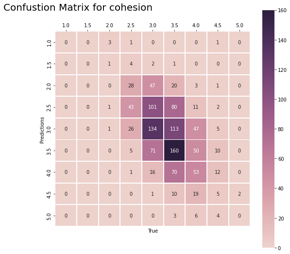

    2.  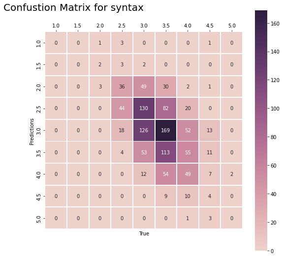

    3.  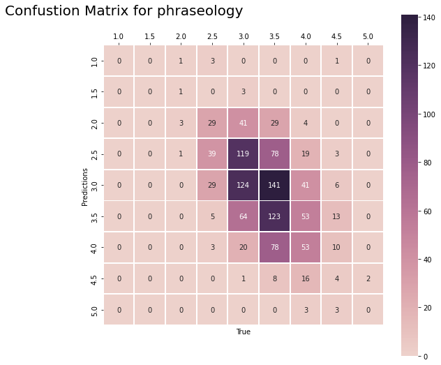

    4.  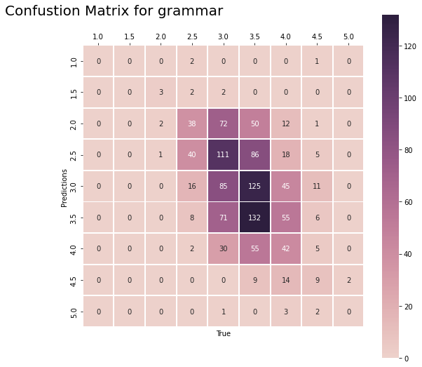

    5.  
